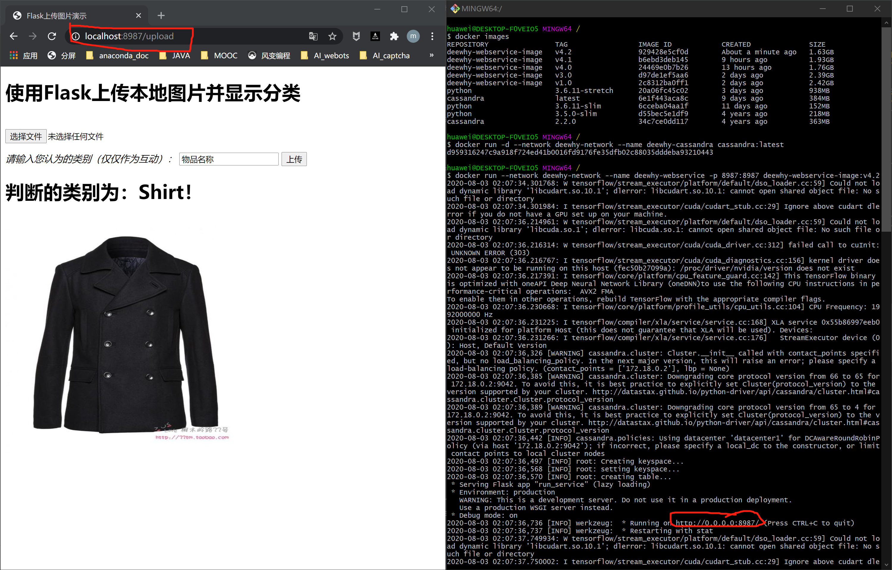

# README

if you can use **docker**, type the following commands in the current directory

```shell
docker network create deewhy-network
docker run --name deewhy-cassandra --network deewhy-network -d cassandra:3.11.7
docker run --name deewhy-webservice --network deewhy-network -p 8987:8987 -d deewhy-webservice-image:v4.2
```

then open any web browser on your computer and type 

`localhost:8987`

into the address bar and enter

you should be able to see a web page which looks like this



then just use the bottons \~

